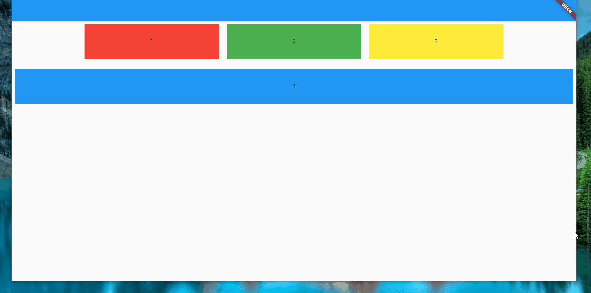

# responsive_grid

Today, with flutter, you can build cross-platform applications with a single project, as you are targeting users with multiscreen size, you will need <b>responsive_grid</b> to ensure the right display depending on the screen size.
Inspired from Bootstrap CSS grid system.

## Preview



## Usage

```dart
class HomePage extends StatelessWidget {
  const HomePage({Key? key}) : super(key: key);

  @override
  Widget build(BuildContext context) {
    return Scaffold(
      appBar: AppBar(),
      body: Container(
        padding: const EdgeInsets.all(8),
        child: ResGrid(
            gridSize: 12, // bootstrap grid is divided to 12 columns, but it's flexible, you can change it to 24
            rowSpacing: 50, // space between rows
            colSpacing: 20, // space between columns (children)
            rowCrossAxisAlignment: CrossAxisAlignment.center, // cross axis alignment in row of children
            rowMainAxisAlignment: MainAxisAlignment.center, // main axis alignment in row of children
            children: [
              ResGridItem(
                child: Container(
                  height: 90,
                  color: Colors.red,
                  padding: const EdgeInsets.all(8),
                  child: const Center(child: Text("1")),
                ),
                col: // extra small screen 12,
                colSm: 6, // small screen
                colMd: 4, // medium screen
                colLg: 3, // large screen
              ),
              ResGridItem(
                child: Container(
                  height: 90,
                  color: Colors.green,
                  padding: const EdgeInsets.all(8),
                  child: const Center(child: Text("2")),
                ),
                col: 12, // extra small screen
                colSm: 6, // small screen
                colMd: 4, // medium screen
                colLg: 3, // large screen
              ),
              ResGridItem(
                child: Container(
                  height: 90,
                  color: Colors.yellow,
                  padding: const EdgeInsets.all(8),
                  child: const Center(child: Text("3")),
                ),
                col: 12, // extra small screen
                colSm: 6, // small screen
                colMd: 4, // medium screen
                colLg: 3, // large screen
              ),
              ResGridItem(
                child: Container(
                  height: 90,
                  color: Colors.blue,
                  padding: const EdgeInsets.all(8),
                  child: const Center(child: Text("4")),
                ),
                col: 12, // extra small screen
                colSm: 6, // small screen
                colMd: 4, // medium screen
                colLg: 6, // large screen
                canGrow: true, // fill the remaining space if exist
              ),
            ]),
      ),
    );
  }
}
```
